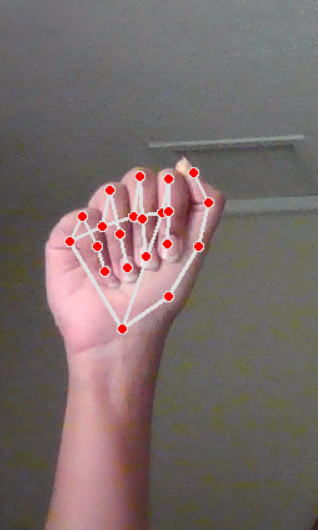
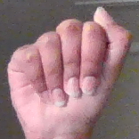
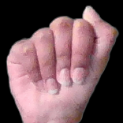
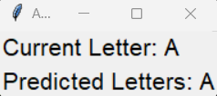

# ASL2Text
---
### Overview

This repository contains a **Convolutional Neural Network** (CNN) model for recognizing **American Sign Language** (ASL) gestures. The model is trained to classify hand signs corresponding to both digits (0-9) and letters (A-Z). This **live** American Sign Language (ASL) to Text Translator is a **Python** program that utilizes *computer vision and machine learning techniques* to interpret hand gestures captured by a webcam and **translate** them into text with a graphical user interface (GUI) to enhance accessibility for ASL users.

### How it was accomplished

1. **Model Prediction:**
   - The **97%** accurate Convolutional Neural Network (CNN) model is loaded to predict the ASL sign.
   - The model has been trained on a diverse [dataset](https://www.kaggle.com/datasets/ayuraj/asl-dataset/data), covering both digits (0-9) and letters (A-Z).

2. **Live Hand Gesture Capture:**
   - The system captures live hand gestures using the computer's camera.
   - It leverages the **Mediapipe** library to detect and track hand landmarks in *real-time*.

   

3. **Background Removal:**
   - The captured hand gesture is isolated by creating a bounding box by taking advantage of the landmarks created.
   - The code uses the **Rembg** library to eliminate the background and create a clean hand image.

    
4. **Translation and GUI Display:**
   - The predicted class is translated into the corresponding letter using a dictionary.
   - The translated letter is displayed on a user-friendly Tkinter GUI.
   - The GUI also shows the current letter being signed and maintains a *history* of predicted letters.
5. **User Interaction:**
   - Users can press the **spacebar** to capture a frame of their hand gesture.
   - The GUI *dynamically* updates to show the recognized letter and the history of predicted letters.
   - The system runs continuously until the user presses **'q'**, making it convenient for communication.
   
   

### Usage

1. Download Python 3.9.6 [here](https://www.python.org/downloads/release/python-396/)
2. Clone the repository:
   ```bash
   git clone https://github.com/Keta-Khatri/ASL2Text.git
   ```
3. Install dependencies:
    ```bash
   pip install -r requirements.txt
   ```
4. Fix compatibility issues:
    ```bash
    pip uninstall opencv-python
    pip uninstall opencv-python-headless
    pip install opencv-python
    ```
5. Run the ASL recoginition:
    ```bash
   python main.py
   ```
---
Credit:

|Name|Email|
|----|-----|
|Vaishnavi Ratnasabapathy|vratnasa@uwaterloo.ca|
|Keta Khatri|k3khatri@uwaterloo.ca|

MIT License

Copyright (c) 2023, Vaishnavi Ratnasabapathy, Keta Khatri

Permission is hereby granted, free of charge, to any person obtaining a copy
of this software and associated documentation files (the "Software"), to deal
in the Software without restriction, including without limitation the rights
to use, copy, modify, merge, publish, distribute, sublicense, and/or sell
copies of the Software, and to permit persons to whom the Software is
furnished to do so, subject to the following conditions:

The above copyright notice and this permission notice shall be included in all
copies or substantial portions of the Software.

THE SOFTWARE IS PROVIDED "AS IS", WITHOUT WARRANTY OF ANY KIND, EXPRESS OR
IMPLIED, INCLUDING BUT NOT LIMITED TO THE WARRANTIES OF MERCHANTABILITY,
FITNESS FOR A PARTICULAR PURPOSE AND NONINFRINGEMENT. IN NO EVENT SHALL THE
AUTHORS OR COPYRIGHT HOLDERS BE LIABLE FOR ANY CLAIM, DAMAGES OR OTHER
LIABILITY, WHETHER IN AN ACTION OF CONTRACT, TORT OR OTHERWISE, ARISING FROM,
OUT OF OR IN CONNECTION WITH THE SOFTWARE OR THE USE OR OTHER DEALINGS IN THE
SOFTWARE.


